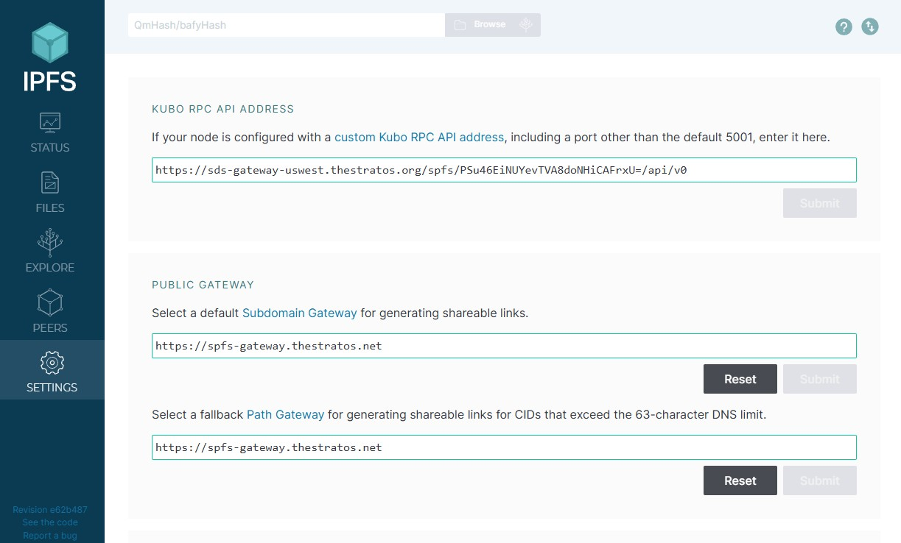
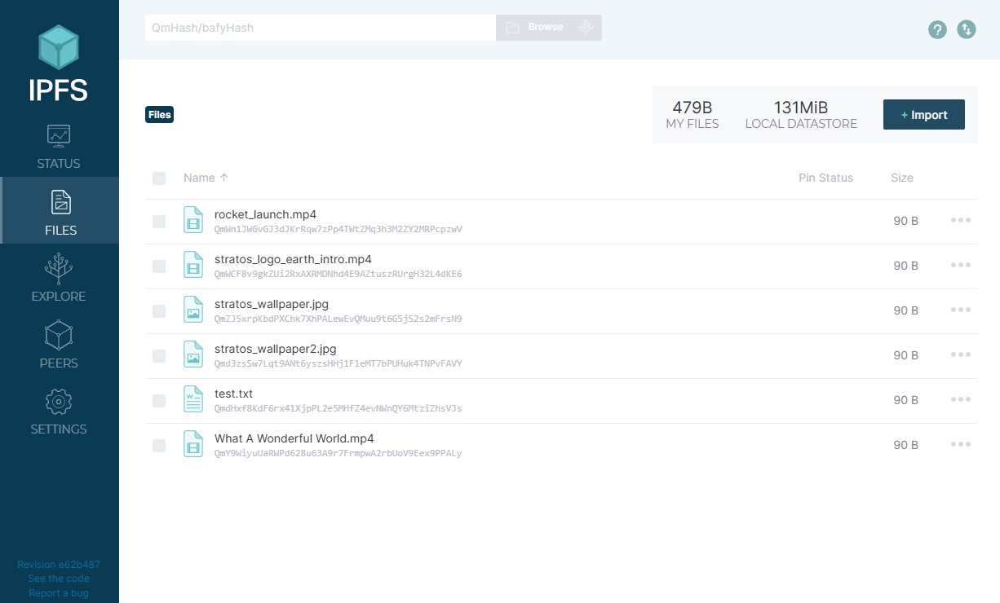
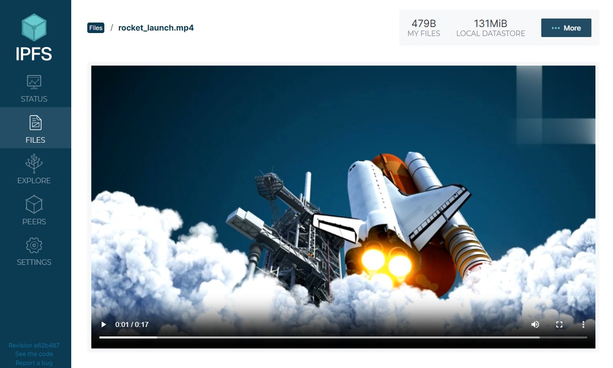
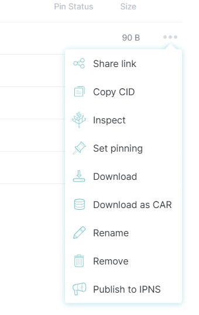
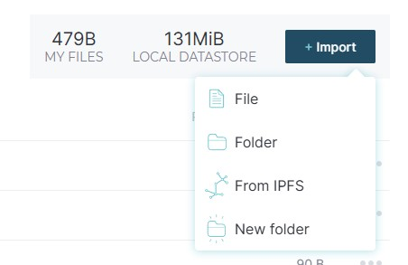

# Stratos IPFS Quick Guide

## Overview

Stratos IPFS (SPFS) is an IPFS cluster maintained by the Stratos Network, leveraging Stratos Decentralized Storage (SDS) for robust and persistent data storage. 

SPFS functions just like IPFS but offers enhanced reliability and guaranteed data availability. 

This guide provides a publicly shared SPFS API token for testing purposes. However, you can request your own private access token by emailing <a href="mailto:info@thestratos.org">info@thestratos.org</a>.

A private access token provides exclusive access to your personal storage, ensuring only you can use it. Your data remains inaccessible to others unless you explicitly share it. The token is free with usage limitations, which can be expanded through a subscription. 

For RPC API details, please refer to IPFS Docs: <a href="https://docs.ipfs.tech/reference/kubo/rpc/#getting-started" target="_blank">Kubo RPC API</a>

!!! warning
    This RPC API is in beta version and is openly accessible for testing. 

    **DO NOT** upload sensitive or private information, as it can be viewable by others.
---

## Connect WebUI to Stratos API

Step 1: Open IPFS WebUI

- Navigate to <a href="https://webui.ipfs.io" target="_blank">webui.ipfs.io</a>

- If not automatically redirected, go to Settings

Step 2: Configure Custom Addresses

- In the WebUI settings, for `Kubo RPC API address`, insert the following RPC API URL and click Submit:

```shell
https://sds-gateway-uswest.thestratos.org/spfs/PSu46EiNUYevTVA8doNHiCAFrxU=/api/v0
```

!!! tip

    If you want your own unique token for the API URL where you can have your private access to SPFS, 

    email <a href="mailto:info@thestratos.org">info@thestratos.org</a>

- For `Public Gateway`, insert the following URL and click Submit:

```shell
https://spfs-gateway.thestratos.net
```

- Use the same URL for `fallback Path Gateway`.



---

## Use WebUI with Stratos API

Go to the Files section in the left-hand menu.

Here, you will find files uploaded by others, displayed with their respective file names and CIDs (Content Identifiers). 

A CID is a unique identifier in IPFS that references a specific file, ensuring content integrity and retrieval.



- Click on a file name to see a preview for that file.



- Click on the three dots (**⋯**) to access individual options for each file. Here, you can:
  
    - Share link - will generate an unique URL using Stratos public gateway
    - Download file
    - Remove file
    - Other IPFS specific operations



- Click on the Import button to

    - Add a new file
    - Add a new folder
    - Add an existing file if you know the CID
    - Create a new folder




----

## IPFS RPC Commands

Common RPC Commands with cURL Examples:

### Add

Add a File to IPFS

**Description**: Upload a file to IPFS

**cURL Example**:
```bash
curl -X POST \
  -F file=@/path/to/your/file.txt \
  "https://sds-gateway-uswest.thestratos.org/spfs/PSu46EiNUYevTVA8doNHiCAFrxU=/api/v0/add"
```

**Expected Result**:
```json
{
  "Name": "file.txt",
  "Hash": "QmXehz92zMLYq3Jv4XmMYkTnu1itfaqHg1hMQUe6XKYrRo",
  "Size": "23"
}
```

---

### Fetch

Retrieve a File from IPFS

**Description**: Download a file from IPFS using its Content Identifier (CID)

**cURL Example**:
```bash
curl -X POST \
  "https://sds-gateway-uswest.thestratos.org/spfs/PSu46EiNUYevTVA8doNHiCAFrxU=/api/v0/get?arg=<CID>" \
  -o output_file.txt
```

---

### Pin

Pin a CID to the Node

**Description**: Ensure a specific file or directory remains available in the IPFS network

**cURL Example**:
```bash
curl -X POST \
  "https://sds-gateway-uswest.thestratos.org/spfs/PSu46EiNUYevTVA8doNHiCAFrxU=/api/v0/pin/add?arg=<CID>"
```

**Expected Result**:
```json
{
  "Pins": ["QmXehz92zMLYq3Jv4XmMYkTnu1itfaqHg1hMQUe6XKYrRo"],
  "Status": "pinned"
}
```

---

### Unpin

Remove a CID from the Node

**Description**: Remove a previously pinned file or directory from persistent storage

**cURL Example**:
```bash
curl -X POST \
  "https://sds-gateway-uswest.thestratos.org/spfs/PSu46EiNUYevTVA8doNHiCAFrxU=/api/v0/pin/rm?arg=<CID>"
```

**Expected Result**:
```json
{
  "Pins": ["QmXehz92zMLYq3Jv4XmMYkTnu1itfaqHg1hMQUe6XKYrRo"],
  "Status": "unpinned"
}
```

---

### MFS Add

Add a CID to Mutable File System (MFS)

**Description**: Add a CID to the IPFS Mutable File System, creating a persistent file reference

**Curl Example**:
```bash
curl -X POST \
  "https://sds-gateway-uswest.thestratos.org/spfs/PSu46EiNUYevTVA8doNHiCAFrxU=/api/v0/files/cp?arg=<CID>&arg=<mfs_path>"
```

---

### MFS List

Show Files in Mutable File System

**Description**: List all files and directories in the IPFS Mutable File System

**Curl Example**:
```bash
curl -X POST \
  "https://sds-gateway-uswest.thestratos.org/spfs/PSu46EiNUYevTVA8doNHiCAFrxU=/api/v0/files/ls"
```

**Expected Result**:
```json
{
  "Entries": [
    {"Name": "file1.txt", "Type": "file", "Size": 1024},
    {"Name": "directory1", "Type": "directory", "Size": 4096}
  ]
}
```

---

### Cat

Display File Contents

**Description**: Show the contents of a file directly in the terminal

**Curl Example**:
```bash
curl -X POST \
  "https://sds-gateway-uswest.thestratos.org/spfs/PSu46EiNUYevTVA8doNHiCAFrxU=/api/v0/cat?arg=<CID>"
``` 

!!! tip

    For the complete list of RPC commands, visit: 

    <a href="https://docs.ipfs.tech/reference/kubo/rpc/#rpc-commands" "target=_blank"> IPFS Kubo RPC API Documentation</a>

---

## IPFS Bash Script

Besides the IPFS WebUI, you can also try out the Stratos RPC API using a custom bash script:

```yaml
wget https://docs.thestratos.org/assets/ipfs/ipfs.sh
chmod +x ipfs.sh
```

Running the script without arguments will print the list of commands available:

```yaml
$ ./ipfs.sh
IPFS Terminal Client - Interact with Stratos RPC API

Usage: /home/user/ipfs.sh COMMAND [ARGS]

Commands:
  fetch <CID> [output_file] - Retrieve file from IPFS
  add <file_path>           - Add a file to IPFS and pin it automatically
  pin <CID>                 - Pin a CID to the node
  unpin <CID>               - Unpin a CID from the node
  mfsadd <CID> <mfs_path>   - Add a CID to the IPFS Mutable File System
  rm <mfs_path>             - Remove a file from IPFS Mutable File System
  id                        - Get node info from Kubo API
  list files                - List files in IPFS Mutable File System (MFS)
  list peers                - List connected IPFS peers
  cat <CID>                 - Display the contents of a file
  map                       - Show the mapping between filenames and CIDs
  inspect <path-or-cid>     - Get detailed info about a file or CID
  lookup <pattern>          - Search for a file or CID by pattern
```
