
<iframe width="560" height="315" src="https://www.youtube.com/embed/DHTZxMNr_Mk?si=msBIbdwSU4aMrlba" title="YouTube video player" frameborder="0" allow="accelerometer; autoplay; clipboard-write; encrypted-media; gyroscope; picture-in-picture; web-share" allowfullscreen></iframe>

---

## Introduction

- IMPORTANT: Before proceding, make sure to download and install the latest version of Stratos Network Wallet [<a href="https://www.thestratos.org/stratos-network-wallet" target="_blank">Download</a>]
- IMPORTANT: Never send STOS directly from Ethereum network to a Stratos wallet. Migration has to go through the bridge app or else the tokens will be lost.
- The bridge web app is only available for Metamask.
- STOS tokens have to be on ETH network and you need some ETH for gas fees.
- If your tokens are on a CEX (other than Gate.io), you need to withdraw them to Metamask first. If your tokens are on Gate.io, you might be interested in withdrawing directly from Gate to Stratos Network (<a href="https://stratosmining.info/token-migration-using-gateio/" target="_blank">tutorial here</a>).
- If in doubt, please use telegram or discord to ask for assistance (links at the bottom of the page). Or, at least, send a small test transaction first, the fee will be worth the trouble if something is wrong. 

---

!!! tip "WARNING"

	The **ONLY** URL for the bridge is:

	<h1><a href="https://app.exoswap.io/" target="_blank">app.exoswap.io</a></h1>

	Always check the URL and beware of scammers!

---

## Ethereum to Stratos

- Make sure your Metamask wallet has STOS tokens as ERC-20 and some ETH for gas fee. Next, open the <a href="https://app.exoswap.io/" target="_blank">bridge URL</a> and connect the wallet.

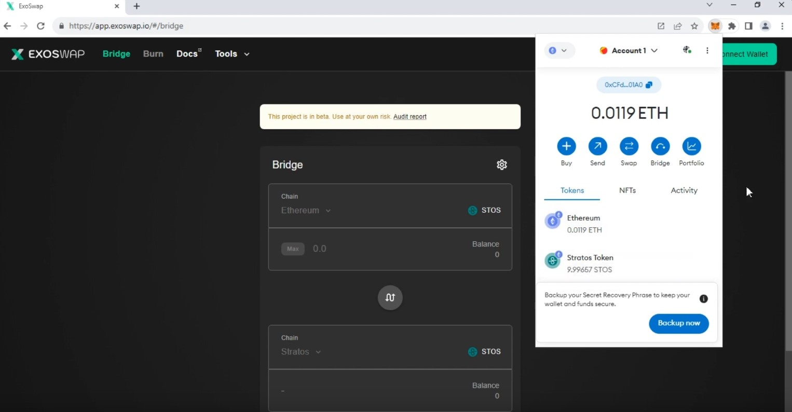

- Enter the amount of STOS you want to bridge and click Approve.

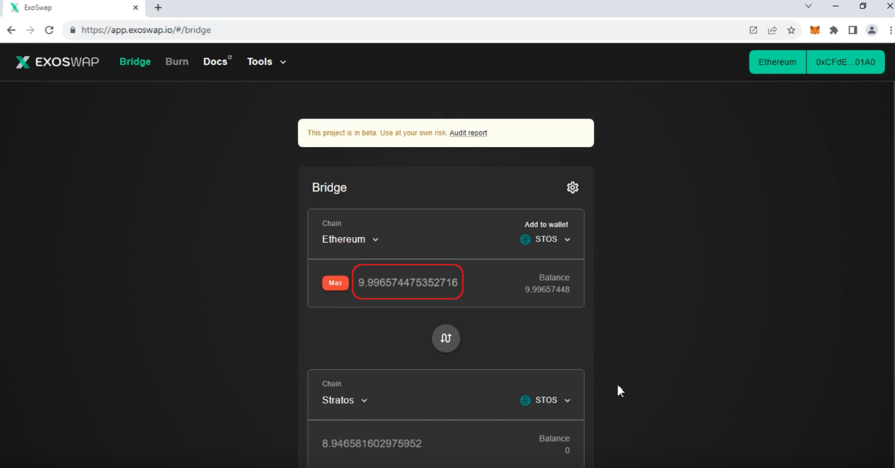

- Approve a spending limit. Make sure you set the limit at least equal to the amount you want to bridge.

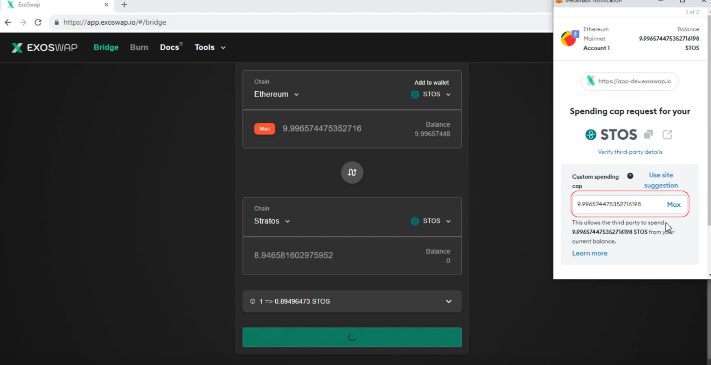

- Once the spending limit is approved, initiate the transfer. This process could take aprox. 2-3 minutes.

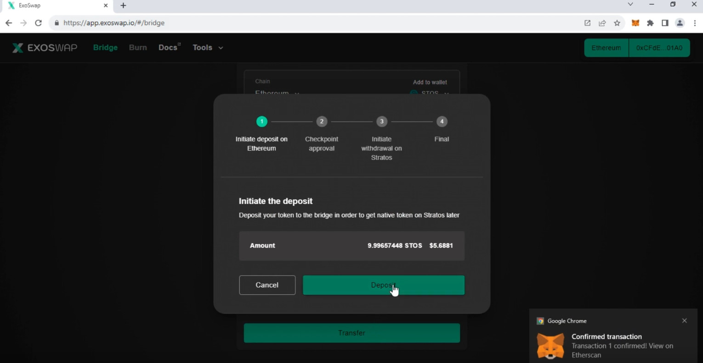

- Next, you need to add the Stratos Network details to Metamask. Click the upper left button and then click `Add Network`.

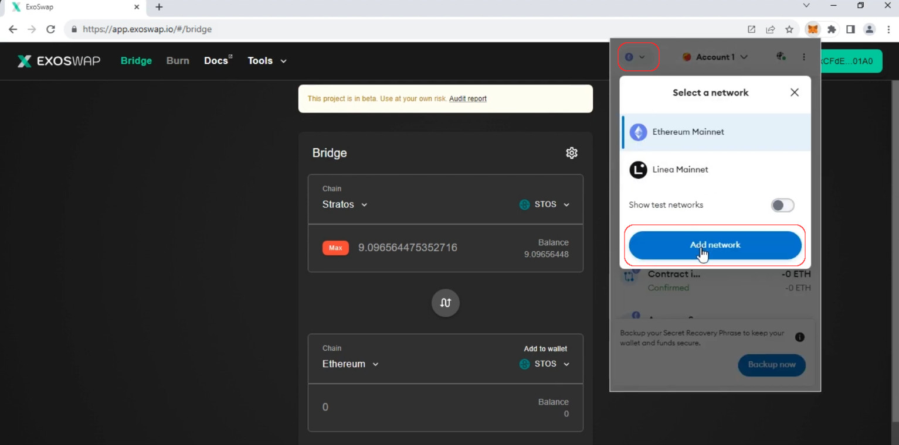

- In the next screen, enter the following details:

| Setting Name | Value |
| ------------ | ----- |
| Network name | `Stratos` |
| New RPC URL  | `https://web3-rpc.thestratos.org` |
| Chain ID     | `2048` |
| Currency symbol | `STOS` |
| Block Explorer URL | `https://web3-explorer.thestratos.org` |

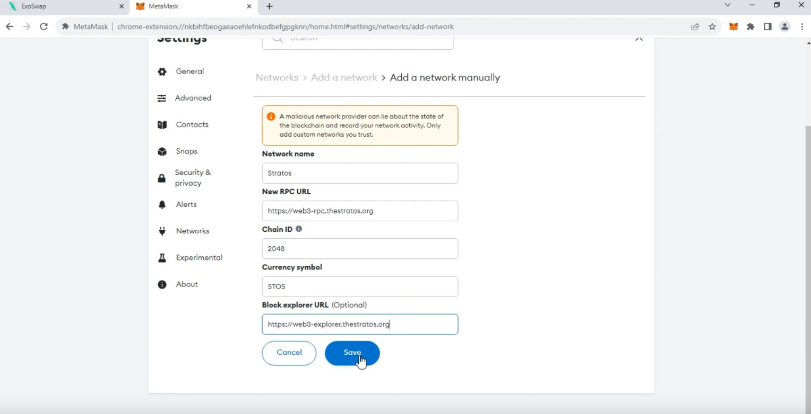

- Your STOS tokens should now be visible on the Stratos network. 

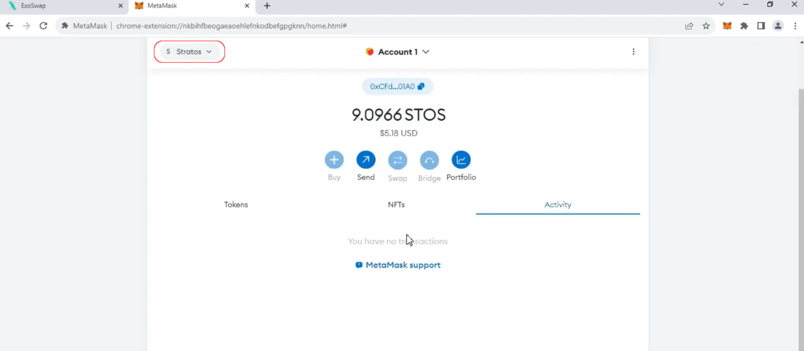

---

## Stratos to Ethereum

Migrating back to Ethereum network is basically the same process, but backwards.

1. Open Metamask and make sure it's connected to Stratos Network.

3. Once you see your STOS tokens in Metamask (connected to Stratos), open <a href="https://app.exoswap.io/#/bridge" target="_blank">ExoSwap</a>.

4. Change the order of the operation using the switch button in the middle and make sure the first chain is set to Stratos:

	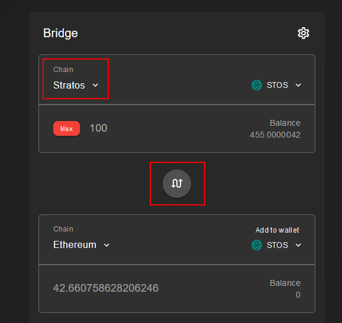

5. Start the transfer process.

!!! warning

	Fees for bridging from Stratos to Ethereum are quite high (out of our control, it's what Ethereum network is charging) so alternatively, you could use the <a href="https://stratosmining.info/token-migration-using-gateio/" target="_blank">migration option through Gate.io</a>.

---

## Stratos to Osmosis

!!! tip "Attention"

	The bridge to Osmosis uses `Keplr Wallet` so you need to have it installed.

1. Open Keplr wallet and go to Menu, then Add/Remove Chains:

	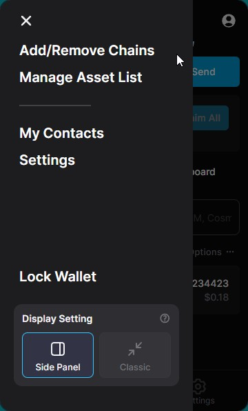

2. Search for `stratos` and enable it:

	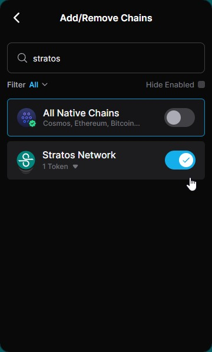

3. You will now see STOS in your assets list. Click on it and send some STOS tokens to the st1xx address:

	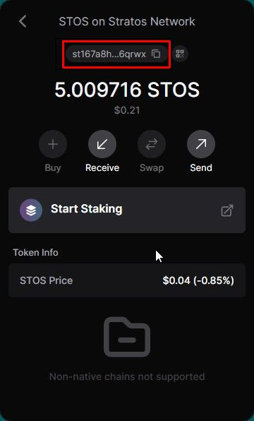

4. Go to Menu / Settings / Advanced and enable Manual IBC Transfer:

	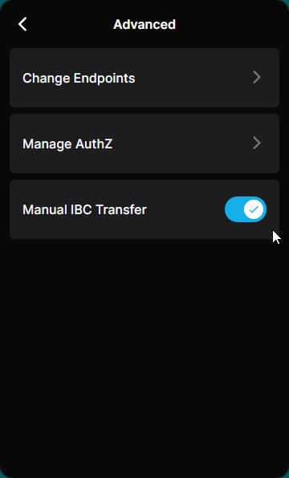

5. From your assets list, click OSMO and copy the address:

	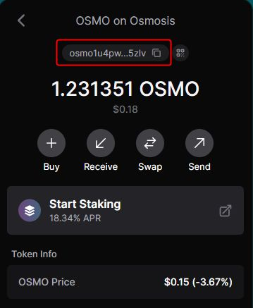

6. At the bottom of your assets list, you should now have a new `Transfer` button.  Click on it and select STOS (Stratos Network).  If you don't see STOS, restart your browser:

	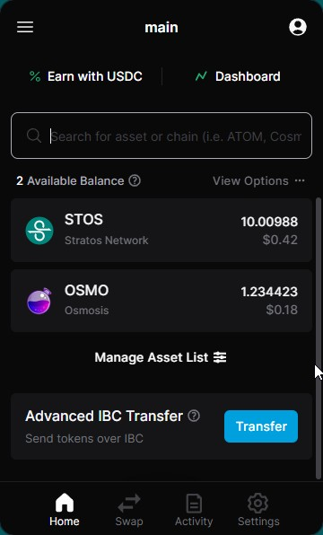

7. On the next screen, in "Destination chain" drop down menu, choose to add a `New IBC Transfer Channel`:

	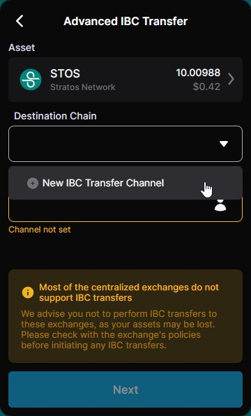

8. Choose `Osmosis` as the destination chain and `channel-1` as source channel id:

	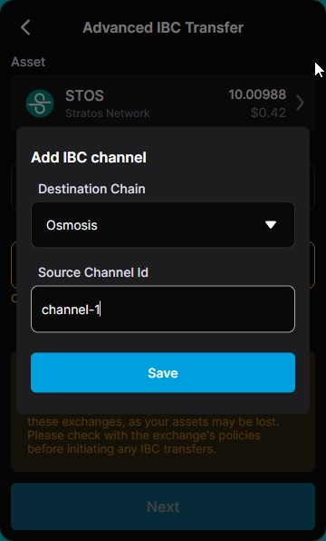

!!! warning

	Entering a wrong channel id will result in losing your funds !

9. In the wallet address, paste the OSMO address you copied earlier at step 5:

	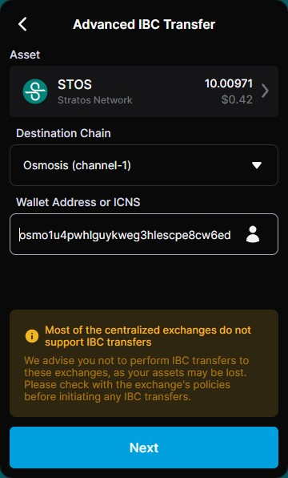

10. Click Next, enter the amount of STOS you want to bridge and Approve the transaction:

	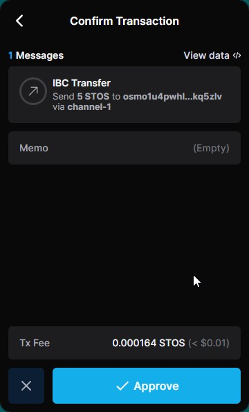

11. You will now see STOS (Osmosis)	in your assets list:

	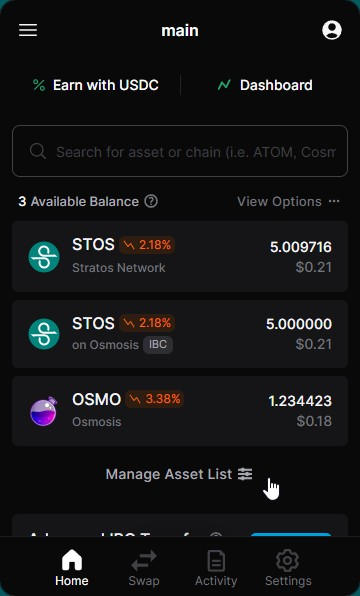

12. Now you can use <a href="https://app.osmosis.zone" target="_blank">app.osmosis.zone</a> to swap STOS to another token. You can swap to OSMO and send it to a CEX you have access to:

	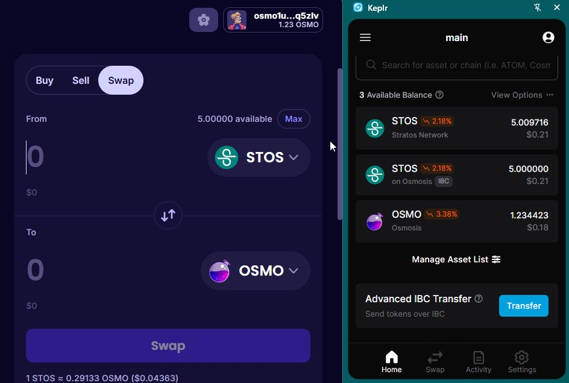

 

---

 

## Osmosis to Stratos

!!! tip "Attention"

	Bridging STOS from Osmosis to Stratos Network requires OSMO tokens to cover for transaction fees so you will need a few cents in your OSMO balance.

If you have OSMO or ATOM or any other token on Osmosis chain, you can swap them to STOS in the <a href="https://app.osmosis.zone" target="_blank">app.osmosis.zone</a> app and bridge them back to Stratos Network:

1. Open Keplr wallet and go to Menu, then Add/Remove Chains:

	

2. Search for `stratos` and enable it:

	

3. You will now see STOS in your assets list.  Click on it to copy the STOS st1xx address:

	

4. Go to Menu / Settings / Advanced and enable Manual IBC Transfer:

	

5. At the bottom of your assets list, you should now have a new `Transfer` button.  Click on it and select STOS (Osmosis).  If you don't see STOS, restart your browser:

	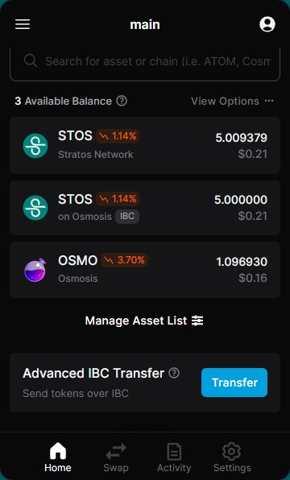	

6. On the next screen, in "Destination chain" drop down menu, choose to add a `New IBC Transfer Channel`:

	

7. Choose `Stratos Network` as the destination chain and `channel-81016` as source channel id:

	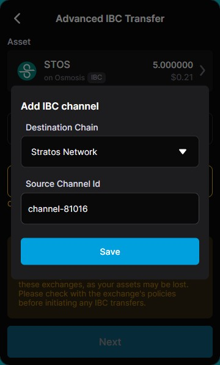

!!! warning

	Entering a wrong channel id will result in losing your funds !

8. In the wallet address, paste the STOS address you copied earlier at step 3.  Alternatively, you can enter another st1xx address (for example, from your Stratos Wallet):

	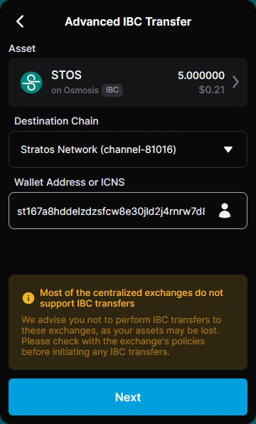

9. Click Next, enter the amount of STOS you want to bridge and Approve the transaction:

	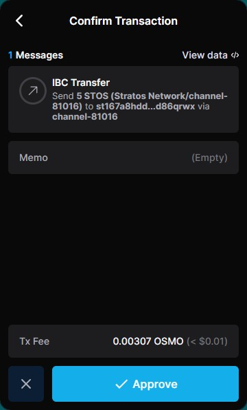

Your STOS tokens are now on the Stratos Network.

---
 